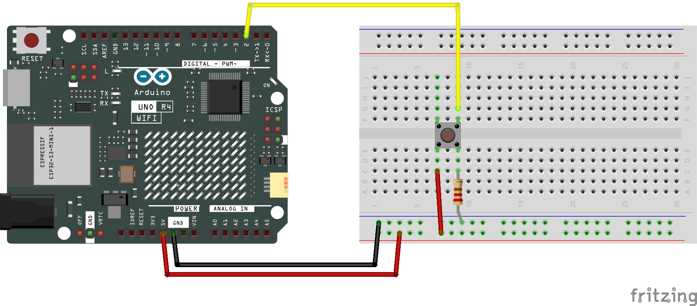

# Button (Push = On)

This Arduino code should when pressing the button down, light up the built in LED.

## Required Hardware:
+ [Arduino UNO R4 WiFi](https://a.co/d/3F1rix2)
+ [Push Button](https://a.co/d/dyIsWco)
+ [Breadboard](https://a.co/d/dyIsWco)
+ [Jumper Wires](https://a.co/d/dyIsWco)