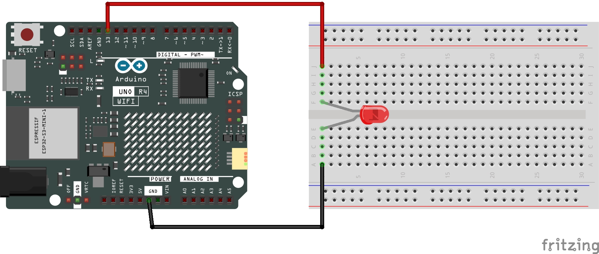

# LED

The Arduino code in conjunction with an LED attached on a breadboard should toggle on and off the connected LED.

Please ensure that the longer leg of the LED is connected to the positive side (Port 13) and the shorter length to the ground (Negative) end.

## Required Hardware:
+ [Arduino UNO R4 WiFi](https://a.co/d/3F1rix2)
+ [LED](https://a.co/d/dyIsWco)
+ [Breadboard](https://a.co/d/dyIsWco)
+ [Jumper Wires](https://a.co/d/dyIsWco)