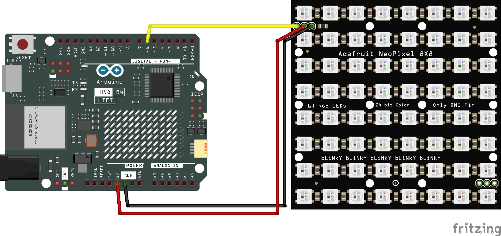

# LED (Matrix 8x8)

This Arduino code should go through the 64 LED, cycling through each LED from Red, Green and then Blue.

## Required Hardware:
+ [Arduino UNO R4 WiFi](https://a.co/d/3F1rix2)
+ [Adafruit NeoPixel NeoMatrix 8x8 - 64 RGB LED Pixel Matrix](https://www.adafruit.com/product/1487)