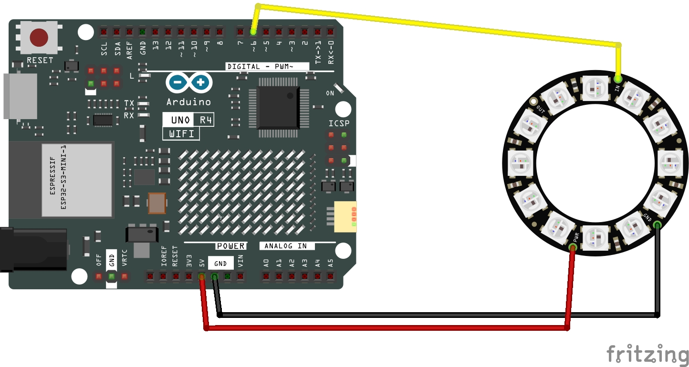

# LED (Matrix Ring x12 RGB LED)

This Arduino code should go through the 12 RGB LED, cycling through each LED from All Red, to All Green and then all Blue.

NOTE: If your first LED is flasing, switch the power to use 3.3V

## Required Hardware:
+ [Arduino UNO R4 WiFi](https://a.co/d/3F1rix2)
+ [NeoPixel Ring - 12 x 5050 RGB LED](https://www.adafruit.com/product/1643)