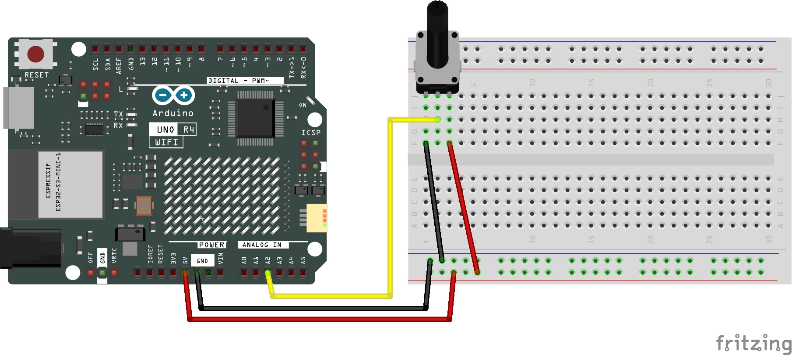

# Potentiometer

This Arduino code once uploaded, and configured properly and once opening the Serial Monitor (Tools > Serial Monitor), should display the value (from 0 to 1024) of the potentiometer.

